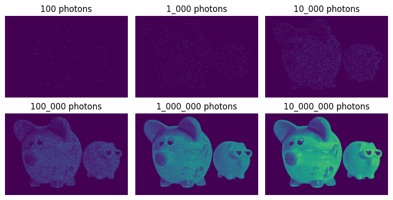
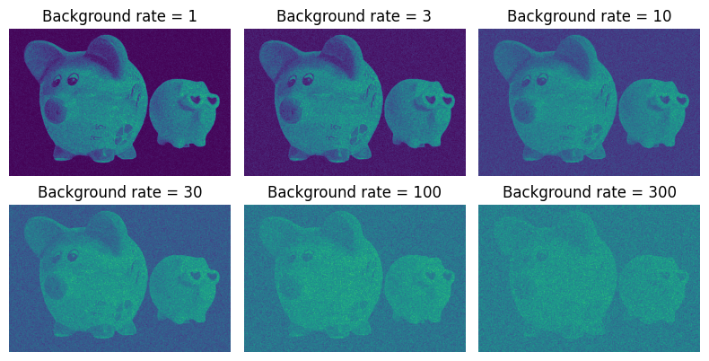

In this first blog post I would like to give a brief introduction to the structure and statistical characteristics of astronomical gamma-ray data from first principles. The post is aimed at a more general audience with a basic understanding of statistics and physics. It should give undergrads and interested researchers in gamma-ray astronomy a more statistical perspective on the data they are working with, while for statisticians it should provide an example for a more real-world application of statistical models.

If you recall the [electromagnetic spectrum](https://en.wikipedia.org/wiki/Electromagnetic_spectrum); gamma-rays correspond to the short wavelength or equivalently the high energy part of the spectrum. Just from the simple consideration that high energy photons require more energy to be produced, we can already infer that gamma-ray photons are more rare than lower energy photons, as for example optical photons. In practice this means that intensities in the gamma-ray range are very low and gamma-ray telescopes are effectively particle detectors: they detect individual photons and reconstruct their arrival direction, time and energy.

Examples of such telescopes include the [Fermi Large Area Telescope](https://fermi.gsfc.nasa.gov/) (LAT) and so called [Imaging Atmospheric Cherenkov Telescopes](https://en.wikipedia.org/wiki/IACT) (IACTs) such as the [CTAO](https://www.cta-observatory.org/), [H.E.S.S.](https://www.mpi-hd.mpg.de/hfm/HESS/), [MAGIC](https://magic.mpp.mpg.de/) and [VERITAS](https://veritas.sao.arizona.edu/).

From a statistical point of view we can describe this as a sampling process. The brightness of the sky is a continuous field or probability density function in space, time and energy and we draw individual samples from it with our telescopes. However the measurement process itself introduces additional uncertainties and artifacts. We are going to mimic this process in a simple toy model using [Numpy](https://numpy.org) to learn more about and illustrate the statistical properties of gamma-ray data.

## Poisson Distribution

First we import Numpy and initialize the random number generator, which is the best practice to ensure reproducibility of the results:


```python
import numpy as np

random_state = np.random.RandomState(2311)
```

We start with a very simple scenario: we have a detector that can detect individual photons and measure their position. However the sky we are looking at has the same brightness everywhere. This means that the probability of detecting a photon at any given position is the same. So we can just draw the x and y coordinates for each photon from a uniform distribution. In total we will draw one million photons:


```python
n_photons_total = 1_000_000
x_max, y_max = (333, 500)

x = random_state.uniform(0, x_max, size=n_photons_total)
y = random_state.uniform(0, y_max, size=n_photons_total)
```

We have chosen a somewhat arbitrary maximum values of `x_max=500` and `y_max=333`. Basically because we will work with another example image later which has exactly this size in pixels. However this image defines now our coordinate system.
The arrays x and y just correspond the position of the photon event in the image in pixel coordinates. It is important to keep in mind that by convention Numpy uses the top left corner as the origin of the coordinate system and the x-axis points to the right and the y-axis points down. This is the opposite of the usual convention in astronomy where the origin is in the lower left of the image and the x-axis points to the right and the y-axis points up. We will stick to the Numpy convention. 

So the arrays x and y just correspond the position of the photon event in the image given in pixel coordinates:


```python
with np.printoptions(precision=2, suppress=True):
    print(f"x coords: {x}")
    print(f"y coords: {y}")
```

    x coords: [107.08 281.72  72.85 ... 247.55 152.44  56.21]
    y coords: [362.52 392.39 301.93 ... 324.83  27.02 355.68]


Now we can easily convert this to an image again, just by counting the number of photons in each pixel. For this we rely on `np.histogram2d`:


```python
from matplotlib import pyplot as plt

bins = np.arange(0, x_max + 1) - 0.5, np.arange(0, y_max + 1) - 0.5
counts = np.histogram2d(x, y, bins=bins)[0]

ax = plt.subplot(111)
ax.imshow(counts, cmap="viridis")
ax.axis("off");
```


    

    


There is one detail in the definition of the histogram bins: we have to define the "edges" of the pixels. By convention the pixel centers are at integer coordinates, so the edges are at half integer coordinates. This is why we have to add 0.5 to the bin definitions and need to use one additional value. As an image of N pixels in a row or column will have N + 1 edges in the respective direction. The resulting image is a 2D histogram of the photon positions, counting how many photons fall into each pixel defined by its edge coordinates.

This histogram is often called a "counts" image. In this case the image essentially just contains noise. While the image looks rather boring, we can still extract some interesting statistics from it. For this we can count the number of occurrences of a given pixel value. This means how many pixels have 0 photons, how many have 1 photon, how many have 2 photons, and so on. For this we can rely on the `np.unique` function:


```python
x_value, value = np.unique(counts, return_counts=True)
```

Let's visualize this as a histogram:


```python
ax = plt.subplot(111)
x = np.linspace(0, 20, 100)

ax.bar(x_value, value / value.sum(), label="Data", alpha=0.5)

rate = n_photons_total / counts.size
ax.spines[["right", "top"]].set_visible(False)
ax.set_ylabel("Relative Frequency")
ax.set_xlabel("Number of photons per pixel")
ax.set_xticks(np.arange(x.min(), x.max(), 2))
ax.legend();
```


    

    


The distribution is clearly peaked, with a well defined maximum at ~5-6 photons per pixel. It is the well known [Poisson distribution](https://en.wikipedia.org/wiki/Poisson_distribution). 

If we recall the definition of the Poisson distribution given on Wikipedia:

> The Poisson distribution is a discrete probability distribution that expresses the probability of a given number of events occurring in a fixed interval of time and/or space if these events occur with a known average rate and independently of the time since the last event.


So the Poisson distribution naturally arises when a certain number of events occur in a given time or space interval. This is exactly the case for gamma-ray data, where each event corresponds to detecting a single photon and reconstructing the position of the photon event. The Poisson distribution is defined by a single parameter, the average rate of events $\lambda$ occurring per interval and given by:

$$P(k, \lambda) = \frac{\lambda^k e^{-\lambda}}{k!}$$

where $k$ is the number of events, $\lambda$ is the average number of events and $e$ is the Euler number.

What specifically defines the  $\lambda$ in our example case above? It is simply the average number of photons expected per pixel. Which we can compute by:


```python
print(f"Average number of photons per pixel: {n_photons_total / (x_max * y_max):.2f}")
```

    Average number of photons per pixel: 6.01


Now let's plot the shape of the distribution for a few different values of $\lambda$:


```python
from scipy.stats import poisson
import numpy as np
import matplotlib.pyplot as plt

x = np.linspace(0, 10, 100)
lambda_ = np.array([0.5, 1, 2, 4, 8])

ax = plt.subplot(111)

for lam in lambda_:
    ax.plot(x, poisson._pmf(x, mu=lam), label=f"$\lambda$ = {lam}")

ax.legend()
ax.spines[["right", "top"]].set_visible(False)
ax.set_ylabel("Relative Frequency")
ax.set_xlabel("Number of photons");
```


    

    


.. note::
   The distribution is only defined for integer values of $k$. But for illustration purposes we can interpolate between the integer values using the private `._pmf()` method. However the public use of private methods in Python (methods whose name stars with an underscore `_`) is not recommended in general. 


A few important properties of the Poisson distribution are:

- The mean and the variance of the Poisson distribution are equal.
- The probability at $k=0$ is given by $P(0, \lambda) = e^{-\lambda}$. So it is non-zero.
- The sum of two independent Poisson distributions is again a Poisson distribution with the sum of their rates.
- For large $\lambda$ the Poisson distribution approaches a Gaussian distribution with mean $\lambda$ and standard deviation $\sqrt{\lambda}$.

The Poisson distribution defines the fundamental statistical properties of gamma-ray data. It is the starting point for any statistical analysis of gamma-ray data!

So far we have used a uniform spatial distribution of the events. To make things a bit more interesting we can now introduce a non-uniform distribution of the events. For this we first read an example "every day" image of a piggy bank:


```python
image = plt.imread("piggy-bank.png")
```


```python
ax = plt.subplot(111)
ax.imshow(image)
ax.axis("off");
```


    

    


In principle gamma-rays carry information on their "color" (represented by the particle energy or associated wavelength). However for simplicity we discard the information on the wavelength and just compute a gray scale image by averaging the three color channels:


```python
image_bw = image[:, :, :3].mean(axis=2)
```

Using a "false color" representation, the image now looks like:


```python
ax = plt.subplot(111)
ax.imshow(image_bw, cmap="viridis")
ax.axis("off");
```


    

    


As the structure in the image is rather complex, we do not have any analytical or closed form expression for the spatial distribution of the photon events. However, as the image is a discrete ("pixelized") representation anyway, we can simply interpret the image as a probability mass function (PMF): this means a discrete probability densitiy function, where the value in each pixel represents the probability of this pixels index (or position) being drawn from the total distribution. Or more formally:

$$
P(x_{\text{true}} = i) = p_i
$$

where $x_{\text{true}}$ is the true incoming position of the photon and $\sum_i p_i = 1$. This distribution is called a [categorical distribution](https://en.wikipedia.org/wiki/Categorical_distribution) in statistics. To convert the example image to the PMF for a categorial distribution, we just have to normalize the image, so that the sum of all pixel values is 1. Then we can draw samples from the distribution using for example  `np.random.choice`. 

However there is one additional challenge: the variables in the categorial distribution are statistically independent, so the distribution does not "know" anything about the image-like structure. So we have to flatten the image to a 1D array, sample 1D coordinates and then convert them back to 2D coordinates using the `np.unravel_index` function. 

Still we only get the x and y coordinates of the photon events at the pixel center. To allow for the event being detected at any position in the pixel we add a uniform random offset to the x and y coordinates using `random.uniform`. This process of adding noise to randomize quantization errors is often called [Dither](https://en.wikipedia.org/wiki/Dither). Now we can bring everything together in a single function definition:


```python
def sample_events_from_image(image, n_photons, random_state):
    """Sample events from an image."""
    pdf = image / image.sum()
    coords = random_state.choice(np.arange(image.size), p=pdf.ravel(), size=n_photons)
    x, y = np.unravel_index(coords, image_bw.shape)
    x_dither = random_state.uniform(x - 0.5, x + 0.5)
    y_dither = random_state.uniform(y - 0.5, y + 0.5)
    return x_dither, y_dither
```

.. note::
   The uniform blurring of the coordinates within the support of a pixel corresponds to a nearest neighbor interpolation of the event position. In principle we could also use a more sophisticated interpolation scheme, for example I have proposed one [here](https://github.com/gammapy/gammapy/issues/5422). But for now we stick to the simplest possible approach.

Let's take a look at what the different realizations look like. For this we draw a different number of photons from the distribution and create again a counts image by binning the photon positions into a histogram:


```python
n_photons = 10 ** np.arange(2, 8)

fig, axes = plt.subplots(2, 3, figsize=(8, 4.2))

for ax, value in zip(axes.ravel(), n_photons):
    x, y = sample_events_from_image(image_bw, value, random_state)
    counts = np.histogram2d(x, y, bins=bins)[0]
    ax.imshow(counts, cmap="viridis")
    ax.set_title(f"{value:_} photons")
    ax.axis("off")

plt.tight_layout()
```


    

    


You can see that it requires a lot of events to be able to recognise the structure in the image. Only at more than a million photons it looks like a familiar image. The Poisson noise destroys a lot of information, when only few samples are present. 


.. note::
   Instead of drawing the photon positions from a categorical distribution and binning them into a histogram, we could also directly draw from a [Multinomial distribution](https://en.wikipedia.org/wiki/Multinomial_distribution). Which is the generalization of the Binomial distribution, where instead of two possible outcomes there are N possible outcomes, where N is the total number of pixels.  This way we would end up directly with the counts image, without the need to bin the photon positions. Interestingly, when doing so, the values in each independent pixel ares still distributed as a Poisson, with the mean given by the product of the total number of events in the image and the probability associated to each pixel. You can find a more detailed explanation of this relation [here](https://online.stat.psu.edu/stat504/lesson/2/2.3/2.3.6).

However, gamma-ray telescopes do not directly measure the number of photons in each pixel, but only the individual photon events. So we keep the treatment of the image PMF as categorical distribution and the binning of the photon positions into a histogram. That being said, Poisson noise is only one of multiple effects that degrades the quality of gamma-ray images...

## Point Spread Function

All gamma-ray telescopes (in fact any telescope) have a limited angular resolution. Or in simpler words: the telescopes see a "blurry" image of the sky. This comes from the fact that the direction a photon came from, cannot be measured perfectly. The classic analogy of this is throwing darts at a dartboard. As a non-professional player, you can aim for the bulls-eye, but you will not hit it exactly all the time. Instead you end up with a distribution of target positions of the dart around the bulls-eye. Often this distribution is similar to a Gaussian distribution with the highest probability of hitting in the center and the probability decreasing, the further away from the center you go. The sigma of this Gaussian distribution is a measure of the precision of the player throwing the darts. A professional player will have a smaller width of that Gaussian than a non-professional player.

The same applies for imaging telescopes. The photons are detected at a certain position, but the position is not exact. Instead the position is distributed around the true arrival direction of the photon. This is what is called the point spread function (PSF). The smaller the PSF the sharper the image. In reality telescope PSFs are often not symmetrically Gaussian, but have different shapes for example with larger tails or assymetries introduced by the measurement process. 

From a probabilistic point of view, the effect of the PSF can be described by a conditional probability distribution or two consecutive sampling processes. First we sample the "true" position of the photon event using the categorial distribution described above and then we sample the "measured" position of the photon from a Gaussian distribution around the true position of the photon event. This can also be seen as a form of [Gibbs sampling](https://en.wikipedia.org/wiki/Gibbs_sampling).

The PSF is often approximated by a Gaussian distribution with a certain standard deviation $\sigma$. The standard deviation $\sigma$ is a measure of the angular resolution of the telescope. The smaller the $\sigma$ the better the angular resolution of the telescope. So more formally we can describe the Gaussian PSF as:

$$
P(x_{\text{measured}} | x_{\text{true}}) = \frac{1}{2 \pi \sigma^2} \exp \left( - \frac{(x_{\text{measured}} - x_{\text{true}})^2}{2 \sigma^2} \right)
$$

The PSF quantifies the conditional probability $P(x_{\text{measured}} | x_{\text{true}})$. So it answers the question: "Given the true position of the photon event, what is the probability of measuring the photon at a certain position?"

To translate this into code we define a little helper function to sample from the Gaussian PSF:


```python
def apply_psf(x, y, sigma, random_state):
    """Apply a Gaussian point spread function."""
    x_psf = random_state.normal(x, sigma)
    y_psf = random_state.normal(y, sigma)
    return x_psf, y_psf
```

Now let's visualize the effect of the PSF on the image for different values of $\sigma$:


```python
sigmas = [0, 1, 2, 4, 8, 16]

fig, axes = plt.subplots(2, 3, figsize=(8, 4.2))

for ax, sigma in zip(axes.ravel(), sigmas):
    x, y = sample_events_from_image(
        image_bw, n_photons=1_000_000, random_state=random_state
    )
    x, y = apply_psf(x, y, sigma, random_state)
    counts = np.histogram2d(x, y, bins=bins)[0]
    ax.imshow(counts, cmap="viridis")
    ax.set_title(f"PSF $\sigma$ = {sigma} pixels")
    ax.axis("off")

plt.tight_layout()
```


    

    


You can see how the image is blurred by the PSF and the information in the image is successively "destroyed". Spatial detail, such as the eyes, nose and feet are lost. The overall shape also appears smaller, as the sharp edge that marks the outline of the piggy dissolves into the dark background. 

.. note::
   You might have noticed already, but the sampling from the categorial distribution and the subsequent sampling from a Gaussian distribution actually corresponds to the special case of a [Gaussian Mixture Model](https://en.wikipedia.org/wiki/Mixture_model) (GMM): the case where there is a multivariate (2D) Gaussian with an identical diagonal covariance matrix centered on each pixel with a weight given by the value of the pixel.

## Background Emission

Just as natural images often have a background, so do gamma-ray images. The background emission is the emission from all sources in the sky, except the source we are interested in. The background emission is usually not uniform across the sky, but varies with the position in the sky. Knowing the background well, is important for many analyses in the gamma-ray domain. Usually the background is estimated from the data itself, by selecting regions in the sky where no sources are expected and averaging the emission in these regions. For simplicity we will just assume a uniform background emission in this example.

Statistically those two emission components (signal and background) are independent. This means that the probability of observing a photon from the signal emission is independent of the probability of observing a photon from the background emission. Thus the superpostion of the signal and background can be achieved by drawing the events independently from the two distributions and then concatenating the two event lists:


```python
background_rates = [1, 3, 10, 30, 100, 300]

fig, axes = plt.subplots(2, 3, figsize=(8, 4.2))

image_bkg = np.ones(image_bw.shape)
n_pixels = image_bw.size

for ax, background_rate in zip(axes.ravel(), background_rates):
    x_bkg, y_bkg = sample_events_from_image(
        image_bkg, n_photons=int(n_pixels * background_rate), random_state=random_state
    )
    x, y = sample_events_from_image(
        image_bw, n_photons=1_000_000, random_state=random_state
    )
    x_all = np.concatenate([x, x_bkg])
    y_all = np.concatenate([y, y_bkg])

    counts = np.histogram2d(x_all, y_all, bins=bins)[0]
    ax.imshow(counts, cmap="viridis")
    ax.set_title(f"Background rate = {background_rate}")
    ax.axis("off")

plt.tight_layout()
```


    

    


You can see how the background emission adds a constant level of noise to the image and degrades the quality by dissolving the signal or structure of interest in the image.

## Uneven Exposure
Observation time is a valuable resource in astronomy. Most telescopes have a limited field of view and can only observe a small part of the sky for a limited amount of time. Analogous to the process of taking a photograph this is called the exposure time.

Astronomers usually combine multiple of those observations into a single image. As the observation time as well as position varies, it means that the exposure is not uniform within the image. This in turn means that the probability of detecting a photon varies with the position in the image. Which again leads to visible artifacts.

To mimic this effect we define a function that masks out a circular region of the image corresponding to the pointing position and field of view of the telescope:


```python
def get_field_of_view(shape, position, radius_max):
    """Compute field of view mask."""
    mask = np.zeros(shape)
    x, y = np.arange(shape[0]), np.arange(shape[1])
    yy, xx = np.meshgrid(y, x)
    rr = np.sqrt((xx - position[0]) ** 2 + (yy - position[1]) ** 2)
    mask[rr < radius_max] = 1.0
    return mask
```

Now we use this method to limit the field of view of the telescope and sample events only from the remaining circular region. In addition each observation only detects a fraction of the total number of photons. This is a simple model for the effect of uneven exposure:


```python
positions = [(120, 280), (120, 120), (220, 200), (220, 360), (320, 280)]
lifetimes = [1.0, 0.5, 3.3, 1.4, 2.3]
total_livetime = np.sum(lifetimes)

n_photons_total = 200_000

x_per_obs, y_per_obs = [], []

for idx, position, lifetime in zip(range(1, 6), positions, lifetimes):
    mask_fov = get_field_of_view((x_max, y_max), position, radius_max=120)
    n_photons = int(n_photons_total * lifetime / total_livetime)
    x, y = sample_events_from_image(image_bw * mask_fov, n_photons, random_state)
    x_per_obs.append(x)
    y_per_obs.append(y)
```

Now let's visualize the events from the different observations:


```python
fig, axes = plt.subplots(2, 3, figsize=(8, 4.2))

for ax, idx, x, y in zip(axes.ravel(), range(1, 6), x_per_obs, y_per_obs):
    counts = np.histogram2d(x, y, bins=bins)[0]
    ax.imshow(counts, cmap="viridis")
    ax.set_title(f"Observation {idx}")
    ax.axis("off")

x_all, y_all = np.concatenate(x_per_obs), np.concatenate(y_per_obs)

counts_all = np.histogram2d(x_all, y_all, bins=bins)[0]
axes[1, 2].imshow(counts_all, cmap="viridis")
axes[1, 2].set_title("All Combined")
axes[1, 2].axis("off")

plt.tight_layout()
```


    

    


The longer the exposure time, the higher the probability of detecting a photon in this pixel or region. Even though the underlying emission is the same. The effect of the exposure can be seen as a multiplicative factor that "modulates" the underlying emission. Where the observations overlap there is much more exposure, leading to these regions being much brighter in the final image.

In reality the exposure is often not even constant for a single observation, but even varies within the field of view of the telescope. However this effect we have neglected here for simplicity.


## Bringing It All Together

Now we bring all the pieces together and simulate a gamma-ray image including all of the distortions and effects we have discussed above:


```python
x_bkg, y_bkg = sample_events_from_image(
    image_bkg, n_photons=n_pixels, random_state=random_state
)

x_all = np.concatenate([x_all, x_bkg])
y_all = np.concatenate([y_all, y_bkg])
x_all, y_all = apply_psf(x_all, y_all, 6, random_state)

counts = np.histogram2d(x_all, y_all, bins=bins)[0]

fig, axes = plt.subplots(1, 2, figsize=(6.4, 3.2))

axes[0].imshow(image_bw, cmap="viridis")
axes[0].axis("off")
axes[0].set_title("Original Image")

axes[1].imshow(counts, cmap="viridis")
axes[1].axis("off")
axes[1].set_title("Simulated Gamma Ray Data")

plt.tight_layout()
```


    

    


You can see that the image only vaguely resembles the original image. The Poisson noise, the PSF, the background emission and the uneven exposure have all degraded the quality of the image. The image is now a complex mixture of the true emission, the artifacts introduced by the measurement process, background and noise. The challenge in analyzing gamma-ray data is to draw conclusions about the true emission while taking into account the artifacts introduced by the measurement process. This is a complex problem that requires sophisticated statistical methods and models.

You might have already noticed that my avatar at the top of the webpage was created using very similar methods. It resembles my face as seen by a gamma-ray telescope. If you are interested in more detailed and realistic simulation of gamma-ray data, you can take a look at the [Gammapy](https://docs.gammapy.org) package and for example the [Event Sampling Tutorial](https://docs.gammapy.org/1.2/tutorials/analysis-3d/event_sampling.html)

<br>
<div align="center">
<a href="https://raw.githubusercontent.com/adonath/blog.adonath.github.io/main/intro-to-gamma-ray-data.tar.gz"><b>Download the notebook bundle</b></a> |
<a href="https://github.com/adonath/blog.adonath.github.io/discussions/1"><b>Join the Discussion</b></a>
</div>
<br>
_________________________
